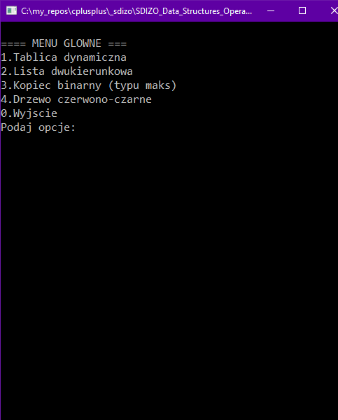
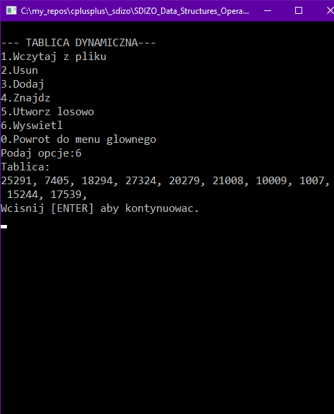
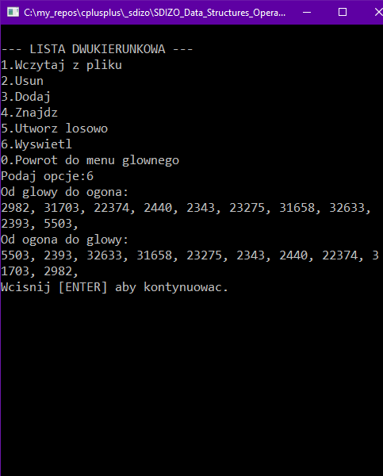
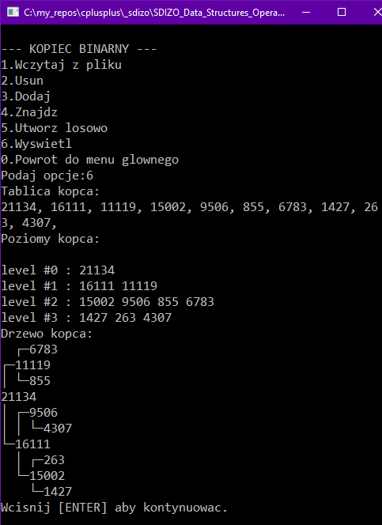
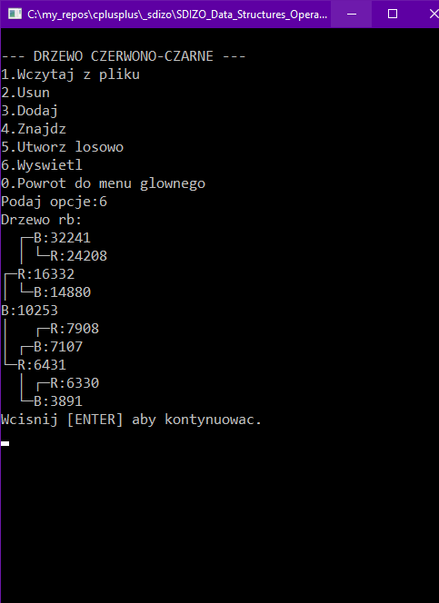

# Data Structures
> Dynamic array, double linked list, heap and red-black tree data structures C++ implementation.

## Table of contents
- [Data Structures](#data-structures)
  - [Table of contents](#table-of-contents)
  - [General info](#general-info)
  - [Screenshots](#screenshots)
  - [Technologies](#technologies)
  - [Setup and run](#setup-and-run)
  - [Features](#features)
  - [Issues](#issues)
  - [Status](#status)
  - [Contact](#contact)

## General info
The main goal of this project was to implement following structures:
* dynamic array,
* double linked list,
* heap,
* red-black tree

and measuere the performance of following operations:
* dynamic array and double linked list:
  * structure generation;
  * adding a new element to a structure:
    * at the beggining,
    * in the middle,
    * at the end;
  * removing given element from a structure:
    * at the beggining,
    * in the middle,
    * at the end;
  * finding given element in a structure;
* heap and red-black Tree:
  * structure generation;
  * adding a new element to a structure;
  * removing given element from a structure;
  * finding given element in a structure;

## Screenshots
|                                               |                                               |                                               |
| :-------------------------------------------: | :-------------------------------------------: | :-------------------------------------------: |
|  |  |  |

|                                               |                                               |
| :-------------------------------------------: | :-------------------------------------------: |
|  |  |


## Technologies
* C++ Language.

## Setup and run
Download project and compile it with C++ compiler.

Input data file must be placed in the same folder as the program executable file. Structure of file (example):
```
5   <-- size of structure / number of elements.
1   \
2   |
3   |- data, each element in separate line.
4   |
5   /
```

## Features
List of features:
* Program can be run in two different modes:
  * Testing mode - it executes a series of tests, where performance of particular operations on each data structure is measuered (time). Results are saved to output file.
  * User mode - with text user interface.
* Avaible operations:
  * Choose structure type.
  * Load stucture from file.
  * Generate random structure.
  * Add element.
  * Remove element.
  * Find element.
  * Show structure.

## Issues
No major issues are known.

## Status
This project is finished and no longer developed.

## Contact
Created by [@michaltkacz](https://github.com/michaltkacz) - feel free to contact me!